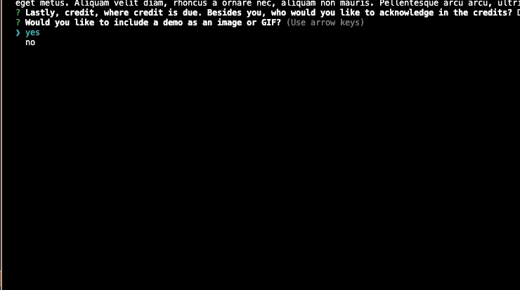

<p align="center">
  
</p>

<h1 align="center">README Reactor 2.0</h3>

<p align="center"><i>Create an atomic README; now more radioactive than ever.</i></p>

<p align="center">
  <a href="https://github.com/Rod-Freedom/C9-README_Reactor_2.0/blob/main/LICENSE"></a>
</p>

<br>
<br>

## **ABOUT THE PROJECT**
### **Overview**
The README Reactor 2.0 comes with a radioactive design, and you don't need to be a nuclear scientist to operate it. Gone are the days of dull, uninspiring READMEs; the RM Reactor 2.0 injects energy and excitement into your documentation, ensuring it grabs attention and keeps readers engaged.

By answering a few questions, you'll give the Reactor the essential elements to run a fusion that will result in an atomic README.md for your repo, following best practices. Remember: a great project needs a great README.

Find the repo [here](https://github.com/Rod-Freedom/C9-README_Reactor_2.0).

<br>
<br>

## Table of Contents
- [License](#license)
- [Resources](#resources)
- [Usage](#usage)
- [Get Started](#get-started)
- [Credits](#credits)
<br>

[(Back to the Top)](#about-the-project)

## Resources
* For Node:
    * `fs` methods.
        * `fs.readdirSync` to find the demo image.
        * `fs.writeFile` to create the README.
    * `import from`
    * `"type": "module"` for exports.
    * `export default` for classes.
    * `export` for functions.
    * `process.stdout` methods to manipulate the console.
* `npm` packages:
    * Inquirer for prompting.
    * Chalk for logs' format.
    * Chalk Animation to animate text in the terminal.
    * Nanospinner for waiting fetches.
* For JavaScript
    * Promises.
    * Object and array destructuring.
    * Classes and constructors.
    * `throw new Error` to stop faulty executions.
    * `setTimeout` executions for UX.

<br>

[(Back to the Top)](#about-the-project)

## Get Started
Once you have the repo on your computer running `git clone`, open your command line. Make sure to open the README Reactor 2.0 repo folder in your terminal. Use `npm i` to install all the modules needed to run the Reactor.

First clone:
```bash
$ git clone [repo]
```
Then install the modules:
```bash
$ npm i
```

<br>

[(Back to the Top)](#about-the-project)

## Usage
The Reactor is easy and intuitive to use. To run it, open the README Reactor 2.0 repo folder in your terminal, then type `node index.js` and hit `enter`. You'll see a glitchy title, but don't worry — it's not malware; it's the app intro animation.
```bash
$ node index.js
```
> 

Next, the Reactor will ask you for your repo and user name. Be sure to write an existing GH repo and user name to continue. If you don't have a license, the Reactor will recommend getting one.  
> 

After that, you'll ride in automatic; answer the questions and hit `return` after each answer.
> 

Finally, you'll be given the option to include a demo in your README. If you choose to do so, you'll need to place an asset in the `./Atomic_README/assets/` directory and press enter. You'll then receive a confirmation that your README is ready. The file will be generated in the `/Atomic_README` folder.
> 


<br>

[(Back to the Top)](#about-the-project)


## License
<br>
See the [license](https://github.com/Rod-Freedom/C9-README_Reactor_2.0/blob/main/LICENSE) for more details.

<br>

[(Back to the Top)](#about-the-project)

## Credits
All the code was created from scratch by [Rod's Freedom](https://github.com/Rod-Freedom) (of course, with the help of the `npm` packages mentioned [above](#resources)).